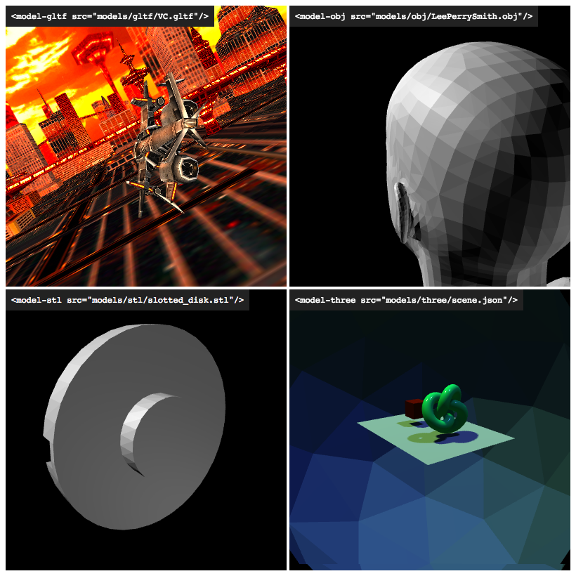

model-tag
========

#### Custom Elements for easily displaying 3D models. ####



### Usage ###

Add this in your page's `<head>`.

```html
<script src="model-gltf.js"></script>
```

Use `<model-gltf>` to load and display your file.

```html
<model-gltf src= src="js/model-gltf.js"/>
```

Same thing with `model-obj`, `model-stl`, `model-three`, ...
